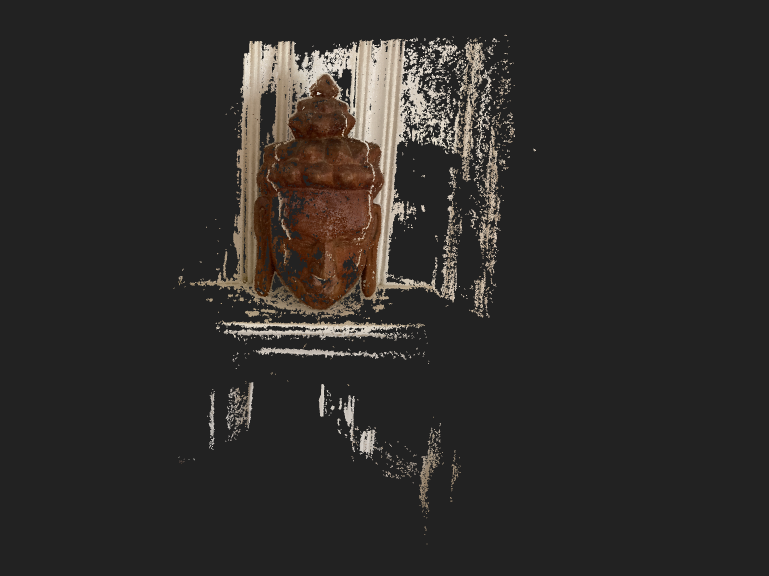
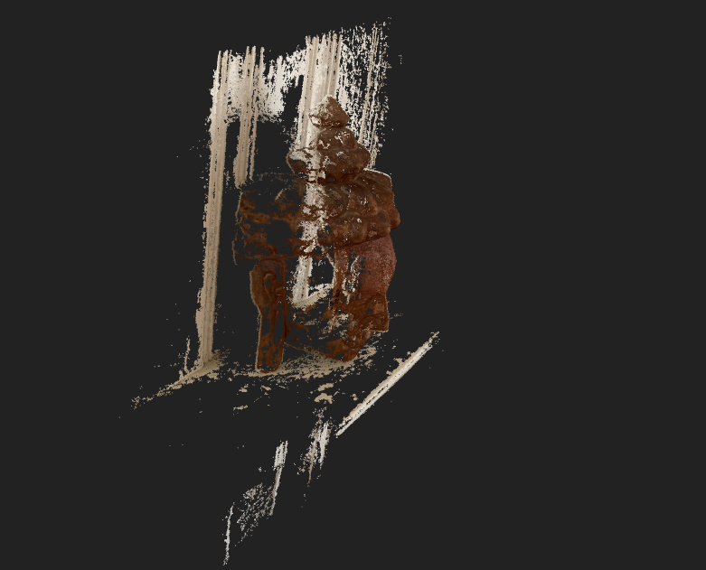

# 3D reconstruction using SfM

## Running the dataset using colmap

I ran the buddha_images dataset using the colmap docker image maintained on Dockerhub. This removes the complexities of installing all the dependencies and building the colmap libraries. 

The automatic reconstructor was used to generate a sparse and dense 3D reconstruction of the Buddha dataset using the below command.

$ docker run --rm -v $(pwd):/data colmap/colmap colmap automatic_reconstructor --image_path /data/images --workspace_path /data/output

The output bin files were converted to readable txt format to check for the (intrinsic and extrinsic) parameters of the camera.

$ docker run --rm -v $(pwd)/data:/data colmap/colmap colmap model_converter --input_path /data/output/sparse/0 --output_path /data/output/text_output --output_type TXT

The results of the reconstruction are:

